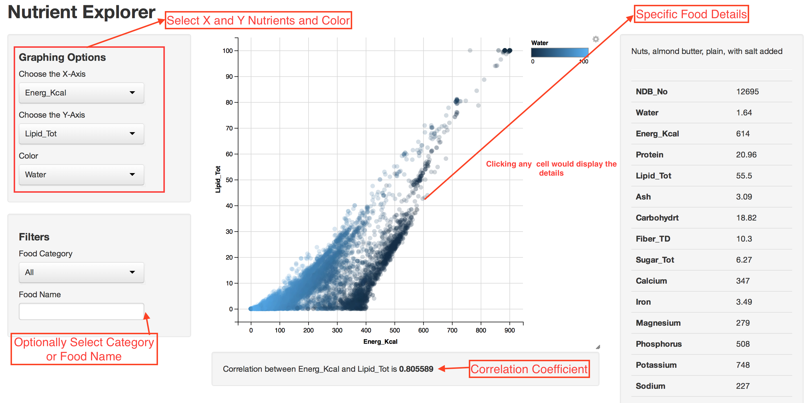

NutrientExplorer
================

USDA Nutrition Data Explorer creating as R Shiny App using ggvis.  You can see the live demo at

http://gavi.shinyapps.io/NutrientExplorer

The current version is based on similar idea in the Shiny Apps gallery

